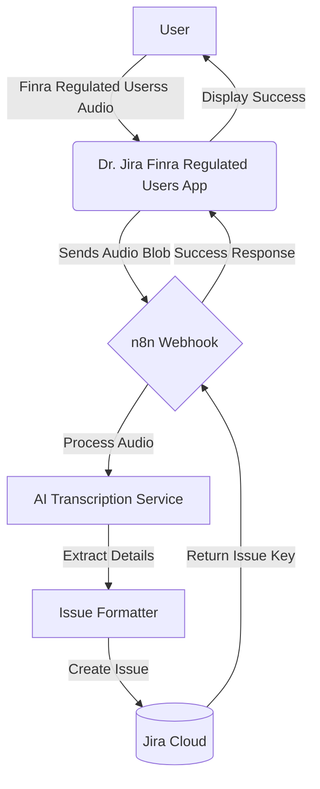

# Dr. Jira Finra

## Overview

**Dr. Jira Finra Regulated Users** is an AI-powered Atlassian Forge app that revolutionizes how you create Jira issues. Instead of typing out lengthy descriptions, you simply speak. The app records your voice, processes it using advanced AI, and automatically populates structured Jira issues with a Summary and Description.

This tool is especially useful for mobile users, field technicians, or anyone who prefers dictation over typing, ensuring that no detail is lost in translation.

## How It Works

1. **Record**: Open the Dr. Jira Finra Regulated Users app in Jira and record your issue details verbally.
2. **Process**: The audio is securely transmitted to an n8n workflow.
3. **Transcribe & Analyze**: The workflow uses AI (like OpenAI Whisper) to transcribe the audio and structure the information.
4. **Create**: A new Jira issue is automatically created with the transcribed details.
5. **Feedback**: The app updates to confirming the issue creation.

## System Flow

## Setup & Deployment

1. **Install Dependencies**: `npm install`
2. **Deploy**: `forge deploy`
3. **Install**: `forge install`

INFO 14:10:51.387 4b959cc2-5db2-48ba-9d17-9a0b2a0b8d78 Received Jira event: avi:jira:commented:issue
ERROR 14:10:51.715 4b959cc2-5db2-48ba-9d17-9a0b2a0b8d78 Failed to initialize database: ForgeSQLAPIError [ForgeSQLError]: Unknown SQL execution error
at checkResponseError (webpack://product-trigger/node_modules/@forge/sql/out/utils/error-handling.js:29:1)
at process.processTicksAndRejections (node:internal/process/task_queues:105:5)
at async SqlClient.storageApi (webpack://product-trigger/node_modules/@forge/sql/out/sql.js:29:1)
at async SqlClient.storageApiWithOptions (webpack://product-trigger/node_modules/@forge/sql/out/sql.js:40:1)
at async SqlClient.executeRaw (webpack://product-trigger/node_modules/@forge/sql/out/sql.js:47:1)
at async initDatabase (webpack://product-trigger/src/lib/db.js:12:1)
at async isDuplicateEvent (webpack://product-trigger/src/lib/db.js:49:1)
at async Object.handleJiraEvent (webpack://product-trigger/src/index.jsx:79:1)
at async /private/var/folders/jh/\_np820bx7w1dxt3sbl5v**000000gn/T/forge-dist-64659-RTL6ibo5on75/**forge_wrapper**.cjs:2:904986
at async process.<anonymous></anonymous> (/Users/jabrealj/.nvm/versions/node/v22.22.0/lib/node_modules/@forge/cli/node_modules/@forge/tunnel/out/sandbox/sandbox-runner.js:11:20) {
responseDetails: { status: 400, statusText: 'Bad Request', traceId: null },
code: 'SQL_EXECUTION_ERROR',
suggestion: 'There was an error while executing the given command. Find more information about the SQL execution error in "debug" field',
context: {
debug: {
code: 'ER_TABLEACCESS_DENIED_ERROR',
errno: 1142,
sqlState: '42000',
sqlMessage: "CREATE command denied to user 'forge_9f_f30591c2adaa147d21a_DML'@'%' for table 'audit_logs'",
sql: '\n' +
' CREATE TABLE IF NOT EXISTS audit_logs (\n' +
' event_id VARCHAR(255) PRIMARY KEY,\n' +
' ts BIGINT,\n' +
' product VARCHAR(50),\n' +
' event_type VARCHAR(100),\n' +
' regulated_user_id VARCHAR(255),\n' +
' actor_id VARCHAR(255),\n' +
' object_type VARCHAR(100),\n' +
' object_id VARCHAR(255),\n' +
' container_id VARCHAR(255),\n' +
' detail TEXT\n' +
' )\n' +
' ',
message: "CREATE command denied to user 'forge_9f_f30591c2adaa147d21a_DML'@'%' for table 'audit_logs'"
},
queryType: 'other'
}
}
ERROR 14:10:51.715 4b959cc2-5db2-48ba-9d17-9a0b2a0b8d78 ForgeSQLAPIError [ForgeSQLError]: Unknown SQL execution error
at checkResponseError (webpack://product-trigger/node_modules/@forge/sql/out/utils/error-handling.js:29:1)
at process.processTicksAndRejections (node:internal/process/task_queues:105:5)
at async SqlClient.storageApi (webpack://product-trigger/node_modules/@forge/sql/out/sql.js:29:1)
at async SqlClient.storageApiWithOptions (webpack://product-trigger/node_modules/@forge/sql/out/sql.js:40:1)
at async SqlClient.executeRaw (webpack://product-trigger/node_modules/@forge/sql/out/sql.js:47:1)
at async initDatabase (webpack://product-trigger/src/lib/db.js:12:1)
at async isDuplicateEvent (webpack://product-trigger/src/lib/db.js:49:1)
at async Object.handleJiraEvent (webpack://product-trigger/src/index.jsx:79:1)
at async /private/var/folders/jh/\_np820bx7w1dxt3sbl5v**000000gn/T/forge-dist-64659-RTL6ibo5on75/**forge_wrapper**.cjs:2:904986
at async process.<anonymous></anonymous> (/Users/jabrealj/.nvm/versions/node/v22.22.0/lib/node_modules/@forge/cli/node_modules/@forge/tunnel/out/sandbox/sandbox-runner.js:11:20) {
responseDetails: { status: 400, statusText: 'Bad Request', traceId: null },
code: 'SQL_EXECUTION_ERROR',
suggestion: 'There was an error while executing the given command. Find more information about the SQL execution error in "debug" field',
context: {
debug: {
code: 'ER_TABLEACCESS_DENIED_ERROR',
errno: 1142,
sqlState: '42000',
sqlMessage: "CREATE command denied to user 'forge_9f_f30591c2adaa147d21a_DML'@'%' for table 'audit_logs'",
sql: '\n' +
' CREATE TABLE IF NOT EXISTS audit_logs (\n' +
' event_id VARCHAR(255) PRIMARY KEY,\n' +
' ts BIGINT,\n' +
' product VARCHAR(50),\n' +
' event_type VARCHAR(100),\n' +
' regulated_user_id VARCHAR(255),\n' +
' actor_id VARCHAR(255),\n' +
' object_type VARCHAR(100),\n' +
' object_id VARCHAR(255),\n' +
' container_id VARCHAR(255),\n' +
' detail TEXT\n' +
' )\n' +
' ',
message: "CREATE command denied to user 'forge_9f_f30591c2adaa147d21a_DML'@'%' for table 'audit_logs'"
},
queryType: 'other'
}
}

invocation: 6a40122b0ffff58d469e9589998b987d index.handleJiraEvent
INFO 14:11:09.033 fa50756c-8374-419f-8da8-8f13f608f531 Received Jira event: avi:jira:commented:issue
ERROR 14:11:09.327 fa50756c-8374-419f-8da8-8f13f608f531 Failed to initialize database: ForgeSQLAPIError [ForgeSQLError]: Unknown SQL execution error
at checkResponseError (webpack://product-trigger/node_modules/@forge/sql/out/utils/error-handling.js:29:1)
at process.processTicksAndRejections (node:internal/process/task_queues:105:5)
at async SqlClient.storageApi (webpack://product-trigger/node_modules/@forge/sql/out/sql.js:29:1)
at async SqlClient.storageApiWithOptions (webpack://product-trigger/node_modules/@forge/sql/out/sql.js:40:1)
at async SqlClient.executeRaw (webpack://product-trigger/node_modules/@forge/sql/out/sql.js:47:1)
at async initDatabase (webpack://product-trigger/src/lib/db.js:12:1)
at async isDuplicateEvent (webpack://product-trigger/src/lib/db.js:49:1)
at async Object.handleJiraEvent (webpack://product-trigger/src/index.jsx:79:1)
at async /private/var/folders/jh/\_np820bx7w1dxt3sbl5v**000000gn/T/forge-dist-64659-RTL6ibo5on75/**forge_wrapper**.cjs:2:904986
at async process.<anonymous></anonymous> (/Users/jabrealj/.nvm/versions/node/v22.22.0/lib/node_modules/@forge/cli/node_modules/@forge/tunnel/out/sandbox/sandbox-runner.js:11:20) {
responseDetails: { status: 400, statusText: 'Bad Request', traceId: null },
code: 'SQL_EXECUTION_ERROR',
suggestion: 'There was an error while executing the given command. Find more information about the SQL execution error in "debug" field',
context: {
debug: {
code: 'ER_TABLEACCESS_DENIED_ERROR',
errno: 1142,
sqlState: '42000',
sqlMessage: "CREATE command denied to user 'forge_9f_f30591c2adaa147d21a_DML'@'%' for table 'audit_logs'",
sql: '\n' +
' CREATE TABLE IF NOT EXISTS audit_logs (\n' +
' event_id VARCHAR(255) PRIMARY KEY,\n' +
' ts BIGINT,\n' +
' product VARCHAR(50),\n' +
' event_type VARCHAR(100),\n' +
' regulated_user_id VARCHAR(255),\n' +
' actor_id VARCHAR(255),\n' +
' object_type VARCHAR(100),\n' +
' object_id VARCHAR(255),\n' +
' container_id VARCHAR(255),\n' +
' detail TEXT\n' +
' )\n' +
' ',
message: "CREATE command denied to user 'forge_9f_f30591c2adaa147d21a_DML'@'%' for table 'audit_logs'"
},
queryType: 'other'
}
}
ERROR 14:11:09.327 fa50756c-8374-419f-8da8-8f13f608f531 ForgeSQLAPIError [ForgeSQLError]: Unknown SQL execution error
at checkResponseError (webpack://product-trigger/node_modules/@forge/sql/out/utils/error-handling.js:29:1)
at process.processTicksAndRejections (node:internal/process/task_queues:105:5)
at async SqlClient.storageApi (webpack://product-trigger/node_modules/@forge/sql/out/sql.js:29:1)
at async SqlClient.storageApiWithOptions (webpack://product-trigger/node_modules/@forge/sql/out/sql.js:40:1)
at async SqlClient.executeRaw (webpack://product-trigger/node_modules/@forge/sql/out/sql.js:47:1)
at async initDatabase (webpack://product-trigger/src/lib/db.js:12:1)
at async isDuplicateEvent (webpack://product-trigger/src/lib/db.js:49:1)
at async Object.handleJiraEvent (webpack://product-trigger/src/index.jsx:79:1)
at async /private/var/folders/jh/\_np820bx7w1dxt3sbl5v**000000gn/T/forge-dist-64659-RTL6ibo5on75/**forge_wrapper**.cjs:2:904986
at async process.<anonymous></anonymous> (/Users/jabrealj/.nvm/versions/node/v22.22.0/lib/node_modules/@forge/cli/node_modules/@forge/tunnel/out/sandbox/sandbox-runner.js:11:20) {
responseDetails: { status: 400, statusText: 'Bad Request', traceId: null },
code: 'SQL_EXECUTION_ERROR',
suggestion: 'There was an error while executing the given command. Find more information about the SQL execution error in "debug" field',
context: {
debug: {
code: 'ER_TABLEACCESS_DENIED_ERROR',
errno: 1142,
sqlState: '42000',
sqlMessage: "CREATE command denied to user 'forge_9f_f30591c2adaa147d21a_DML'@'%' for table 'audit_logs'",
sql: '\n' +
' CREATE TABLE IF NOT EXISTS audit_logs (\n' +
' event_id VARCHAR(255) PRIMARY KEY,\n' +
' ts BIGINT,\n' +
' product VARCHAR(50),\n' +
' event_type VARCHAR(100),\n' +
' regulated_user_id VARCHAR(255),\n' +
' actor_id VARCHAR(255),\n' +
' object_type VARCHAR(100),\n' +
' object_id VARCHAR(255),\n' +
' container_id VARCHAR(255),\n' +
' detail TEXT\n' +
' )\n' +
' ',
message: "CREATE command denied to user 'forge_9f_f30591c2adaa147d21a_DML'@'%' for table 'audit_logs'"
},
queryType: 'other'
}
}

INFO 14:10:51.387 4b959cc2-5db2-48ba-9d17-9a0b2a0b8d78 Received Jira event: avi:jira:commented:issue
ERROR 14:10:51.715 4b959cc2-5db2-48ba-9d17-9a0b2a0b8d78 Failed to initialize database: ForgeSQLAPIError [ForgeSQLError]: Unknown SQL execution error
at checkResponseError (webpack://product-trigger/node_modules/@forge/sql/out/utils/error-handling.js:29:1)
at process.processTicksAndRejections (node:internal/process/task_queues:105:5)
at async SqlClient.storageApi (webpack://product-trigger/node_modules/@forge/sql/out/sql.js:29:1)
at async SqlClient.storageApiWithOptions (webpack://product-trigger/node_modules/@forge/sql/out/sql.js:40:1)
at async SqlClient.executeRaw (webpack://product-trigger/node_modules/@forge/sql/out/sql.js:47:1)
at async initDatabase (webpack://product-trigger/src/lib/db.js:12:1)
at async isDuplicateEvent (webpack://product-trigger/src/lib/db.js:49:1)
at async Object.handleJiraEvent (webpack://product-trigger/src/index.jsx:79:1)
at async /private/var/folders/jh/\_np820bx7w1dxt3sbl5v**000000gn/T/forge-dist-64659-RTL6ibo5on75/**forge_wrapper**.cjs:2:904986
at async process.<anonymous></anonymous> (/Users/jabrealj/.nvm/versions/node/v22.22.0/lib/node_modules/@forge/cli/node_modules/@forge/tunnel/out/sandbox/sandbox-runner.js:11:20) {
responseDetails: { status: 400, statusText: 'Bad Request', traceId: null },
code: 'SQL_EXECUTION_ERROR',
suggestion: 'There was an error while executing the given command. Find more information about the SQL execution error in "debug" field',
context: {
debug: {
code: 'ER_TABLEACCESS_DENIED_ERROR',
errno: 1142,
sqlState: '42000',
sqlMessage: "CREATE command denied to user 'forge_9f_f30591c2adaa147d21a_DML'@'%' for table 'audit_logs'",
sql: '\n' +
' CREATE TABLE IF NOT EXISTS audit_logs (\n' +
' event_id VARCHAR(255) PRIMARY KEY,\n' +
' ts BIGINT,\n' +
' product VARCHAR(50),\n' +
' event_type VARCHAR(100),\n' +
' regulated_user_id VARCHAR(255),\n' +
' actor_id VARCHAR(255),\n' +
' object_type VARCHAR(100),\n' +
' object_id VARCHAR(255),\n' +
' container_id VARCHAR(255),\n' +
' detail TEXT\n' +
' )\n' +
' ',
message: "CREATE command denied to user 'forge_9f_f30591c2adaa147d21a_DML'@'%' for table 'audit_logs'"
},
queryType: 'other'
}
}
ERROR 14:10:51.715 4b959cc2-5db2-48ba-9d17-9a0b2a0b8d78 ForgeSQLAPIError [ForgeSQLError]: Unknown SQL execution error
at checkResponseError (webpack://product-trigger/node_modules/@forge/sql/out/utils/error-handling.js:29:1)
at process.processTicksAndRejections (node:internal/process/task_queues:105:5)
at async SqlClient.storageApi (webpack://product-trigger/node_modules/@forge/sql/out/sql.js:29:1)
at async SqlClient.storageApiWithOptions (webpack://product-trigger/node_modules/@forge/sql/out/sql.js:40:1)
at async SqlClient.executeRaw (webpack://product-trigger/node_modules/@forge/sql/out/sql.js:47:1)
at async initDatabase (webpack://product-trigger/src/lib/db.js:12:1)
at async isDuplicateEvent (webpack://product-trigger/src/lib/db.js:49:1)
at async Object.handleJiraEvent (webpack://product-trigger/src/index.jsx:79:1)
at async /private/var/folders/jh/\_np820bx7w1dxt3sbl5v**000000gn/T/forge-dist-64659-RTL6ibo5on75/**forge_wrapper**.cjs:2:904986
at async process.<anonymous></anonymous> (/Users/jabrealj/.nvm/versions/node/v22.22.0/lib/node_modules/@forge/cli/node_modules/@forge/tunnel/out/sandbox/sandbox-runner.js:11:20) {
responseDetails: { status: 400, statusText: 'Bad Request', traceId: null },
code: 'SQL_EXECUTION_ERROR',
suggestion: 'There was an error while executing the given command. Find more information about the SQL execution error in "debug" field',
context: {
debug: {
code: 'ER_TABLEACCESS_DENIED_ERROR',
errno: 1142,
sqlState: '42000',
sqlMessage: "CREATE command denied to user 'forge_9f_f30591c2adaa147d21a_DML'@'%' for table 'audit_logs'",
sql: '\n' +
' CREATE TABLE IF NOT EXISTS audit_logs (\n' +
' event_id VARCHAR(255) PRIMARY KEY,\n' +
' ts BIGINT,\n' +
' product VARCHAR(50),\n' +
' event_type VARCHAR(100),\n' +
' regulated_user_id VARCHAR(255),\n' +
' actor_id VARCHAR(255),\n' +
' object_type VARCHAR(100),\n' +
' object_id VARCHAR(255),\n' +
' container_id VARCHAR(255),\n' +
' detail TEXT\n' +
' )\n' +
' ',
message: "CREATE command denied to user 'forge_9f_f30591c2adaa147d21a_DML'@'%' for table 'audit_logs'"
},
queryType: 'other'
}
}

invocation: 6a40122b0ffff58d469e9589998b987d index.handleJiraEvent
INFO 14:11:09.033 fa50756c-8374-419f-8da8-8f13f608f531 Received Jira event: avi:jira:commented:issue
ERROR 14:11:09.327 fa50756c-8374-419f-8da8-8f13f608f531 Failed to initialize database: ForgeSQLAPIError [ForgeSQLError]: Unknown SQL execution error
at checkResponseError (webpack://product-trigger/node_modules/@forge/sql/out/utils/error-handling.js:29:1)
at process.processTicksAndRejections (node:internal/process/task_queues:105:5)
at async SqlClient.storageApi (webpack://product-trigger/node_modules/@forge/sql/out/sql.js:29:1)
at async SqlClient.storageApiWithOptions (webpack://product-trigger/node_modules/@forge/sql/out/sql.js:40:1)
at async SqlClient.executeRaw (webpack://product-trigger/node_modules/@forge/sql/out/sql.js:47:1)
at async initDatabase (webpack://product-trigger/src/lib/db.js:12:1)
at async isDuplicateEvent (webpack://product-trigger/src/lib/db.js:49:1)
at async Object.handleJiraEvent (webpack://product-trigger/src/index.jsx:79:1)
at async /private/var/folders/jh/\_np820bx7w1dxt3sbl5v**000000gn/T/forge-dist-64659-RTL6ibo5on75/**forge_wrapper**.cjs:2:904986
at async process.<anonymous></anonymous> (/Users/jabrealj/.nvm/versions/node/v22.22.0/lib/node_modules/@forge/cli/node_modules/@forge/tunnel/out/sandbox/sandbox-runner.js:11:20) {
responseDetails: { status: 400, statusText: 'Bad Request', traceId: null },
code: 'SQL_EXECUTION_ERROR',
suggestion: 'There was an error while executing the given command. Find more information about the SQL execution error in "debug" field',
context: {
debug: {
code: 'ER_TABLEACCESS_DENIED_ERROR',
errno: 1142,
sqlState: '42000',
sqlMessage: "CREATE command denied to user 'forge_9f_f30591c2adaa147d21a_DML'@'%' for table 'audit_logs'",
sql: '\n' +
' CREATE TABLE IF NOT EXISTS audit_logs (\n' +
' event_id VARCHAR(255) PRIMARY KEY,\n' +
' ts BIGINT,\n' +
' product VARCHAR(50),\n' +
' event_type VARCHAR(100),\n' +
' regulated_user_id VARCHAR(255),\n' +
' actor_id VARCHAR(255),\n' +
' object_type VARCHAR(100),\n' +
' object_id VARCHAR(255),\n' +
' container_id VARCHAR(255),\n' +
' detail TEXT\n' +
' )\n' +
' ',
message: "CREATE command denied to user 'forge_9f_f30591c2adaa147d21a_DML'@'%' for table 'audit_logs'"
},
queryType: 'other'
}
}
ERROR 14:11:09.327 fa50756c-8374-419f-8da8-8f13f608f531 ForgeSQLAPIError [ForgeSQLError]: Unknown SQL execution error
at checkResponseError (webpack://product-trigger/node_modules/@forge/sql/out/utils/error-handling.js:29:1)
at process.processTicksAndRejections (node:internal/process/task_queues:105:5)
at async SqlClient.storageApi (webpack://product-trigger/node_modules/@forge/sql/out/sql.js:29:1)
at async SqlClient.storageApiWithOptions (webpack://product-trigger/node_modules/@forge/sql/out/sql.js:40:1)
at async SqlClient.executeRaw (webpack://product-trigger/node_modules/@forge/sql/out/sql.js:47:1)
at async initDatabase (webpack://product-trigger/src/lib/db.js:12:1)
at async isDuplicateEvent (webpack://product-trigger/src/lib/db.js:49:1)
at async Object.handleJiraEvent (webpack://product-trigger/src/index.jsx:79:1)
at async /private/var/folders/jh/\_np820bx7w1dxt3sbl5v**000000gn/T/forge-dist-64659-RTL6ibo5on75/**forge_wrapper**.cjs:2:904986
at async process.<anonymous></anonymous> (/Users/jabrealj/.nvm/versions/node/v22.22.0/lib/node_modules/@forge/cli/node_modules/@forge/tunnel/out/sandbox/sandbox-runner.js:11:20) {
responseDetails: { status: 400, statusText: 'Bad Request', traceId: null },
code: 'SQL_EXECUTION_ERROR',
suggestion: 'There was an error while executing the given command. Find more information about the SQL execution error in "debug" field',
context: {
debug: {
code: 'ER_TABLEACCESS_DENIED_ERROR',
errno: 1142,
sqlState: '42000',
sqlMessage: "CREATE command denied to user 'forge_9f_f30591c2adaa147d21a_DML'@'%' for table 'audit_logs'",
sql: '\n' +
' CREATE TABLE IF NOT EXISTS audit_logs (\n' +
' event_id VARCHAR(255) PRIMARY KEY,\n' +
' ts BIGINT,\n' +
' product VARCHAR(50),\n' +
' event_type VARCHAR(100),\n' +
' regulated_user_id VARCHAR(255),\n' +
' actor_id VARCHAR(255),\n' +
' object_type VARCHAR(100),\n' +
' object_id VARCHAR(255),\n' +
' container_id VARCHAR(255),\n' +
' detail TEXT\n' +
' )\n' +
' ',
message: "CREATE command denied to user 'forge_9f_f30591c2adaa147d21a_DML'@'%' for table 'audit_logs'"
},
queryType: 'other'
}
}
