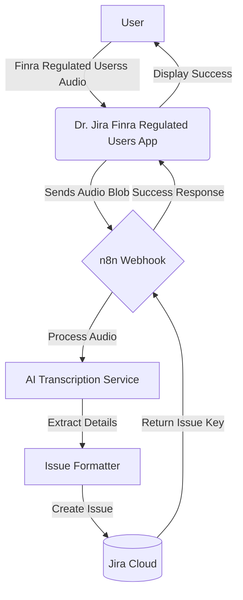

# Dr. Jira Finra

## Overview

**Dr. Jira Finra Regulated Users** is an AI-powered Atlassian Forge app that revolutionizes how you create Jira issues. Instead of typing out lengthy descriptions, you simply speak. The app records your voice, processes it using advanced AI, and automatically populates structured Jira issues with a Summary and Description.

This tool is especially useful for mobile users, field technicians, or anyone who prefers dictation over typing, ensuring that no detail is lost in translation.

## How It Works

1. **Record**: Open the Dr. Jira Finra Regulated Users app in Jira and record your issue details verbally.
2. **Process**: The audio is securely transmitted to an n8n workflow.
3. **Transcribe & Analyze**: The workflow uses AI (like OpenAI Whisper) to transcribe the audio and structure the information.
4. **Create**: A new Jira issue is automatically created with the transcribed details.
5. **Feedback**: The app updates to confirming the issue creation.

## System Flow

## Setup & Deployment

1. **Install Dependencies**: `npm install`
2. **Deploy**: `forge deploy`
3. **Install**: `forge install`

## Event Triggers vs. Polling Mechanisms

The app utilizes two distinct tracking mechanisms to monitor regulated user actions:

### 1. Real-Time Event Triggers
Most Jira and Confluence interactions are captured instantly via real-time webhooks defined in the manifest. These events do not poll:
- **Jira Tracked Events**: Mentions, comment additions (`avi:jira:commented:issue`), and attachment creations (`avi:jira:created:attachment`).
- **Confluence Tracked Events**: Page, comment, and attachment creations or updates.

### 2. Scheduled Polling (Reconciliation)
Since Confluence does not natively emit real-time webhook events for reactions (likes and unlikes), the app runs a scheduled task:
- **Reaction Poller**: A background worker running every 5 minutes (`interval: fiveMinute`). It fetches recent pages and blog posts, pulls their active likes, and diffs them against previously stored lists in the Forge Key-Value Store (KVS) to detect new likes from regulated users.
