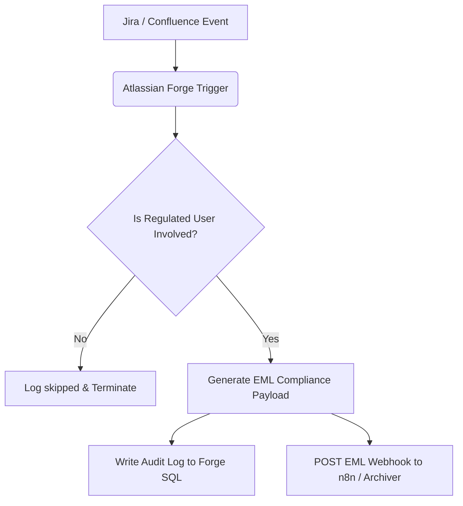

# Dr. Jira FINRA Regulated User Tracker

## Overview

**Dr. Jira FINRA Regulated User Tracker** is a compliance and auditing Atlassian Forge application. It automatically monitors and tracks activities (comments, mentions, attachments, and reactions) in Jira and Confluence performed by regulated users (such as stock brokers or financial representatives). 

The app archives compliance logs by converting the event details into standardized EML (RFC 822) mail formats and dispatching them to an external auditing/compliance archiving endpoint (such as an n8n webhook workflow).

## How It Works

1. **Capture**: The app captures real-time events from Jira and Confluence (or via a scheduled reaction poller for page likes).
2. **Filter**: The app checks the event actors and mentioned users against a list of FINRA regulated users defined in the Admin configuration.
3. **Format**: If any regulated users are involved, the app generates a standardized EML file representing the audit log.
4. **Record & Archive**: The event is recorded in a secure Forge SQL database and the EML payload is POSTed via a webhook to the configured target server (e.g. n8n).

## System Flow

## Setup & Deployment

1. **Install Dependencies**: `npm install`
2. **Deploy**: `forge deploy`
3. **Install**: `forge install`

## Event Triggers vs. Polling Mechanisms

The app utilizes two distinct tracking mechanisms to monitor regulated user actions:

### 1. Real-Time Event Triggers
Most Jira and Confluence interactions are captured instantly via real-time webhooks defined in the manifest. These events do not poll:
- **Jira Tracked Events**: Mentions, comment additions (`avi:jira:commented:issue`), and attachment creations (`avi:jira:created:attachment`).
- **Confluence Tracked Events**: Page, comment, and attachment creations or updates.

### 2. Scheduled Polling (Reconciliation)
Since Confluence does not natively emit real-time webhook events for reactions (likes and unlikes), the app runs a scheduled task:
- **Reaction Poller**: A background worker running every 5 minutes (`interval: fiveMinute`). It fetches recent pages and blog posts, pulls their active likes, and diffs them against previously stored lists in the Forge Key-Value Store (KVS) to detect new likes from regulated users.
