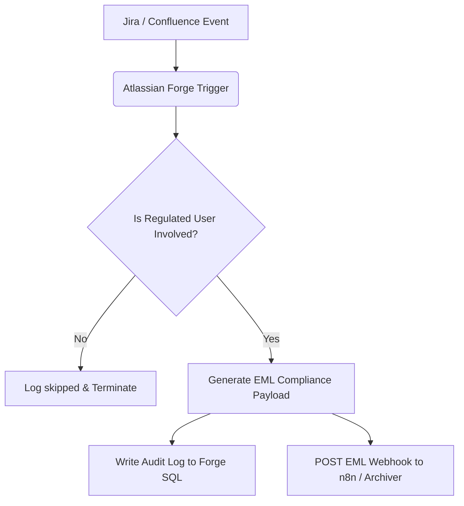
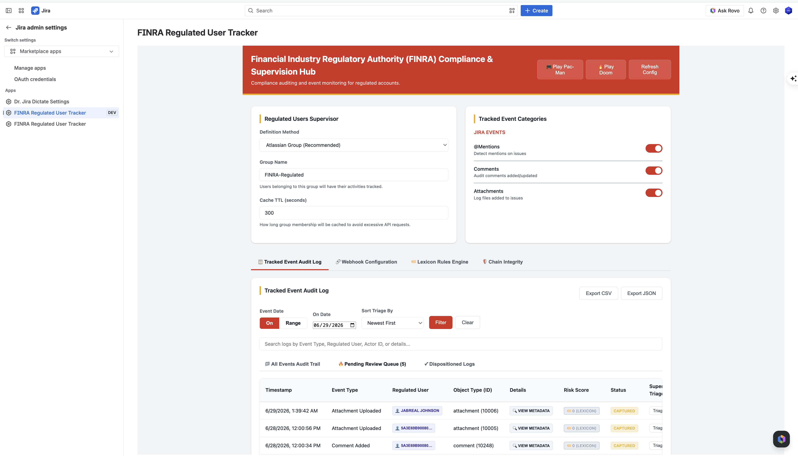
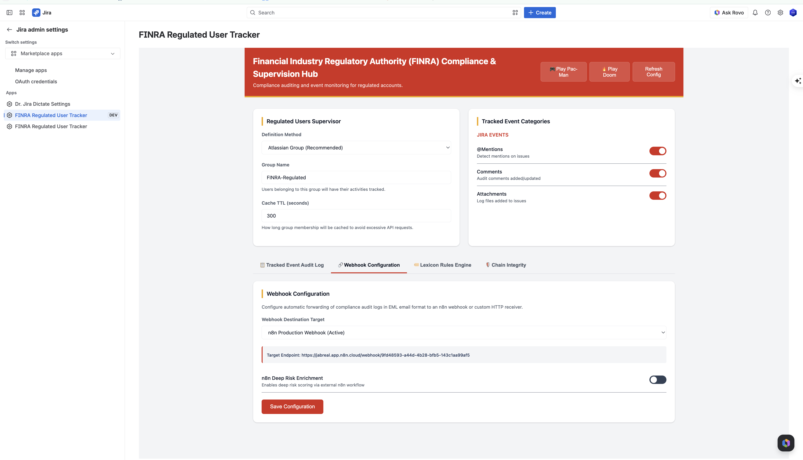
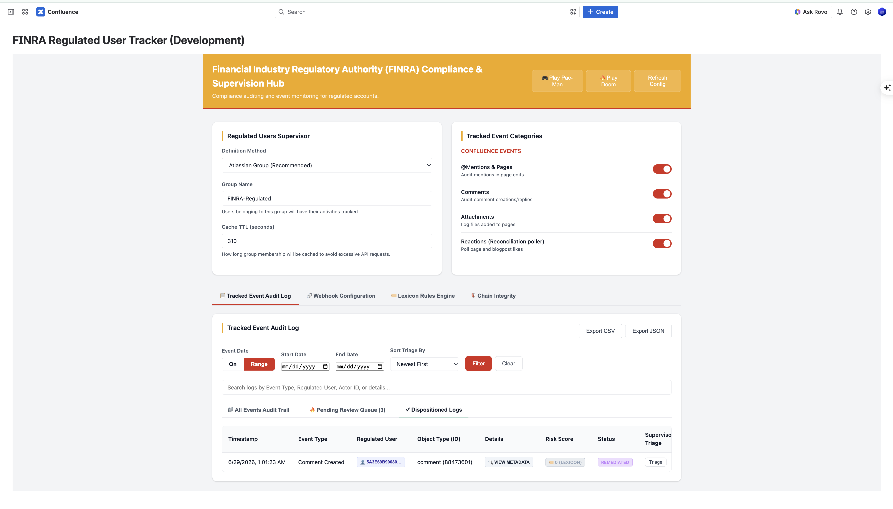
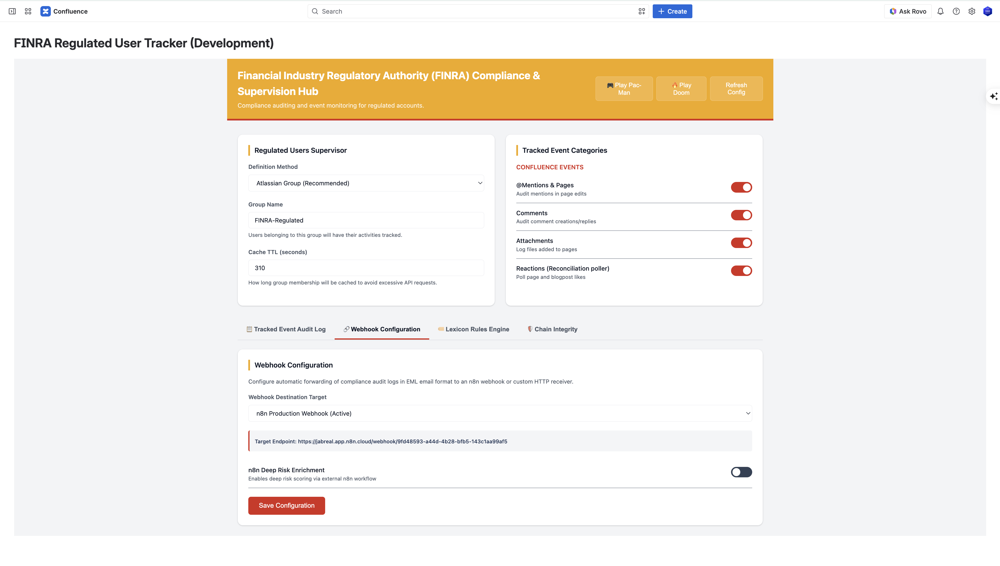
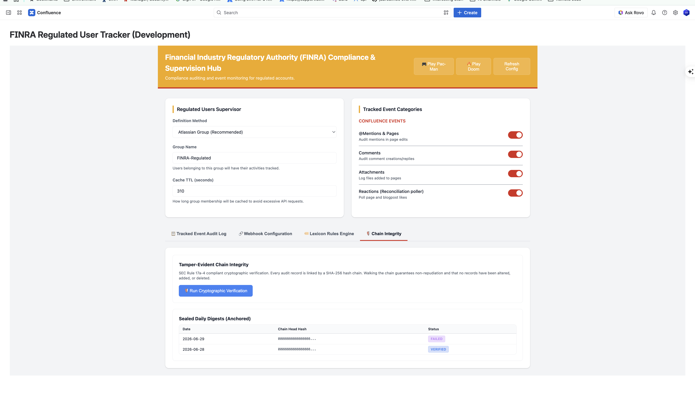

# Dr. Jira FINRA Regulated User Tracker

  

## Overview

**Dr. Jira FINRA Regulated User Tracker** is a compliance and auditing Atlassian Forge application. It automatically monitors and tracks activities (comments, mentions, attachments, and reactions) in Jira and Confluence performed by regulated users (such as stock brokers or financial representatives). 

The app archives compliance logs by converting the event details into standardized EML (RFC 822) mail formats and dispatching them to an external auditing/compliance archiving endpoint (such as an n8n webhook workflow).

## How It Works

1. **Capture**: The app captures real-time events from Jira and Confluence (or via a scheduled reaction poller for page likes).
2. **Filter**: The app checks the event actors and mentioned users against a list of FINRA regulated users defined in the Admin configuration.
3. **Format**: If any regulated users are involved, the app generates a standardized EML file representing the audit log.
4. **Record & Archive**: The event is recorded in a secure Forge SQL database and the EML payload is POSTed via a webhook to the configured target server (e.g. n8n).

## System Flow

## Screenshots

### Jira Admin Panel

#### Tracked Event Audit Log
View, filter, and triage captured compliance events — with per-event risk scoring via the Lexicon engine and supervisor disposition workflow.

#### Webhook Configuration
Configure the n8n webhook endpoint used to forward EML-formatted audit payloads to your compliance archiving pipeline.

---

### Confluence Admin Panel

#### Tracked Event Audit Log
The same audit log experience surfaces in Confluence, tracking @mentions, comments, attachments, and reaction polling events for regulated users.

#### Webhook Configuration
Confluence shares the same webhook configuration interface, targeting your n8n production webhook for EML delivery.

#### Chain Integrity
SEC Rule 17a-4 compliant tamper-evident verification — every audit record is linked via a SHA-256 hash chain. Run cryptographic verification and view sealed daily digests.

---

## Setup & Deployment

1. **Install Dependencies**: `npm install`
2. **Deploy**: `forge deploy`
3. **Install**: `forge install`

## Event Triggers vs. Polling Mechanisms

The app utilizes two distinct tracking mechanisms to monitor regulated user actions:

### 1. Real-Time Event Triggers
Most Jira and Confluence interactions are captured instantly via real-time webhooks defined in the manifest. These events do not poll:
- **Jira Tracked Events**: Mentions, comment additions (`avi:jira:commented:issue`), and attachment creations (`avi:jira:created:attachment`).
- **Confluence Tracked Events**: Page, comment, and attachment creations or updates.

### 2. Scheduled Polling (Reconciliation)
Since Confluence does not natively emit real-time webhook events for reactions (likes and unlikes), the app runs a scheduled task:
- **Reaction Poller**: A background worker running every 5 minutes (`interval: fiveMinute`). It detects new **likes** (the "Like" button / thumbs-up) from regulated users by diffing the current likers of each scanned content item against lists stored in the Forge Key-Value Store (KVS). The content it scans is the union of (a) recently modified pages and blog posts and (b) pages and blog posts **authored by regulated users** (resolved via CQL) — the latter ensures likes on a regulated user's older content are still caught, since liking does not update a page's modified-date.

> **Scope limitation — emoji reactions are not tracked.** Confluence Cloud exposes **no public REST API for emoji reactions** (the 👍/🎉/etc. react feature), and there is no corresponding Forge scope. Only the classic **Like** button is observable via API, so only likes are audited. If/when Atlassian ships a reactions API, this poller can be extended to cover them.

---

## Detailed Trigger & Filtering Rules

### 1. Regulated User Identification Logic
For every event captured, the system checks if a **regulated user** is involved. A user is flagged as regulated if:
1. They belong to the Atlassian Group configured in the Admin UI (defaults to `FINRA-Regulated`).
2. The lookup uses a cached REST check (`GET /wiki/rest/api/user/memberof` for Confluence and `GET /rest/api/3/user/groups` for Jira) with a 5-minute TTL.

The app scans the following associations:
* **Actor/Author**: The user who performed the action (created a page, commented, uploaded an attachment).
* **Assignee/Reporter**: The assignee or reporter of a Jira ticket.
* **Mentions**: Any users explicitly mentioned (`[~accountid:...]` in Jira ADF or user mention tags in Confluence XHTML) inside comments, issue descriptions, or page bodies.

---

### 2. Event Specifications & Trigger Conditions

| Product | Module / Trigger | Trigger Event | Checked Fields |
| :--- | :--- | :--- | :--- |
| **Jira** | `product-trigger` | `avi:jira:commented:issue` | Comment Author, Mentions in comment body |
| **Jira** | `product-trigger` | `avi:jira:created:attachment` | Attachment Author |
| **Jira** | `product-trigger` | `avi:jira:created:issue` | Reporter, Creator, Assignee, Mentions in description |
| **Jira** | `product-trigger` | `avi:jira:updated:issue` | Updater, Assignee, Mentions in description/comments |
| **Confluence** | `product-trigger` | `avi:confluence:created:page` | Page Creator |
| **Confluence** | `product-trigger` | `avi:confluence:updated:page` | Page Editor |
| **Confluence** | `product-trigger` | `avi:confluence:created:comment` | Comment Author, Mentions in comment body |
| **Confluence** | `product-trigger` | `avi:confluence:updated:comment` | Comment Editor, Mentions in comment body |
| **Confluence** | `scheduled-trigger` | `pollReactions` (every 5m) | Users who added a page / blog post reaction |

---

### 3. Webhook Delivery Policy
* **Filtering**: If **no** regulated users are identified as actor or mention targets, the execution halts immediately. No webhook is dispatched.
* **Payload Format**: Standardized EML email format (`message/rfc822`) sent via HTTP POST with `Content-Type: text/plain` containing headers (From, To, Date, Subject, Message-ID) and a details body.

